# customers-amount-spent-EDA-regression-DS006
Predict the customer yearly spent and also find out which one between ecommerce market based on app or website is the best!  

## 
Executive Summary

An ecommerce business which needed to decide between focus on a market based on mobile app and a market based on website is answered through this analysis. Based on the given dataset, the market based on mobile app has a higher correlation to generate more yearly spent than the market based on website.  

Futhermore, a strong relationship between length of membership & yearly users spent found. Therefore, to increase the yearly spent of users, user behaviours analysis to obtain knowledge of measures to lengthen of users membership should be done.  

In addition, a model is built to predict the yearly spent of users which the performance are:
- explained variance: **0.973**
- mean absolute error: **119.947**
- root mean squared error: **10.952** (mean of target column= 499.314)
- r2: **0.972**

---

## Content  
**[Executive Summary](#executive)**  
1. **[Introduction](#introduction)**  
1. **[Planning](#planning)**      
1. **[Exploratory Data Analysis - Visualization](#eda)**  
1. **[Regression Assumptions Check](#assumption)**  
1. **[Final Results](#result)**  

---

## 
Introduction

#### Business Problem  
Ecommerce businesses are type of businesses that are required to dynamically & flexibility pivot on their operations. Quick & real-time overview on the present condition will be valuable for stakeholders to implement new ideas, innovations, or even changes of operations. One more thing to note is about market segmentation. As shown by the dataset, there are market based on applications and also on website. Between these 2 different market segments, we should prioritize which one should we focus on.  

#### Business Requirement  
- Visualizations on the present condition of business operations for stakeholders take actions.  
- Predicting yearly amount spent.
- Which one between market based on app and based on website should we focus on.  

#### Data Sources  
The dataset used is from Kaggle, thanks to [SAURABH KOLAWALE](https://www.kaggle.com/datasets/kolawale/focusing-on-mobile-app-or-website).  

The columns inside dataset:  
- 'Email', 
- 'Address', 
- 'Avatar', 
- 'Avg. Session Length', 
- 'Time on App',
- 'Time on Website', 
- 'Length of Membership', 
- 'Yearly Amount Spent' 

---

## 
Planning

#### EDA  (Structure Investigation, Quality Investigation, Visualization)
- the distribution of each columns (numerical & categorical)  
- the relationship between columns  
- correlation analysis - the correlation between yearly amount of spent with other columns  
- answering questions:  
  - descriptive analysis of each column
  - yearly amount spent differences between market based on app & website
  - Geographical
      - the distribution of state
      - the average of yearly amount spent in each state
      - the average of avg. session length in each state
      - the average of time on app in each state
      - the average of time on website in each state
      - the average of length of membership in each state
  - email_service_provider distribution  

#### Data Preprocessing  
- remove outliers  
- imputate or remove missing values/columns = **no missing values found**
- remove unnecessary column = **Avatar, Address**
- regression assumption check:
    - linearity
    - hom sket
    - residual
    - multi-collinear

#### Feature Engineering  
- creation of new columns:  
    - email_service_provider  
    - state
    - domain
- Scale numerical columns  
- Encode categorical columns  

#### Feature Selection  
- L1 Regression  
- Random forest features importance  

#### Modelling  
- Methods = ElasticNet, SVR, GradientBoost, RandomForest

#### Modelling Evalution
- Crossvalidation
- Metric: RMSE

#### Final Model  
- train final model
- dump as joblib

#### Production  
- REST API

---

## 
Exploratory Data Analysis - Visualization
  
Here are useful findings found in the dataset:  
- The distribution of numerical columns which all of them are nearly normal distribution.  
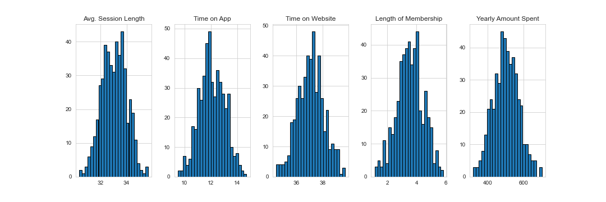  

- These are the relations among numerical columns, shown by scatterplot & barplot. 
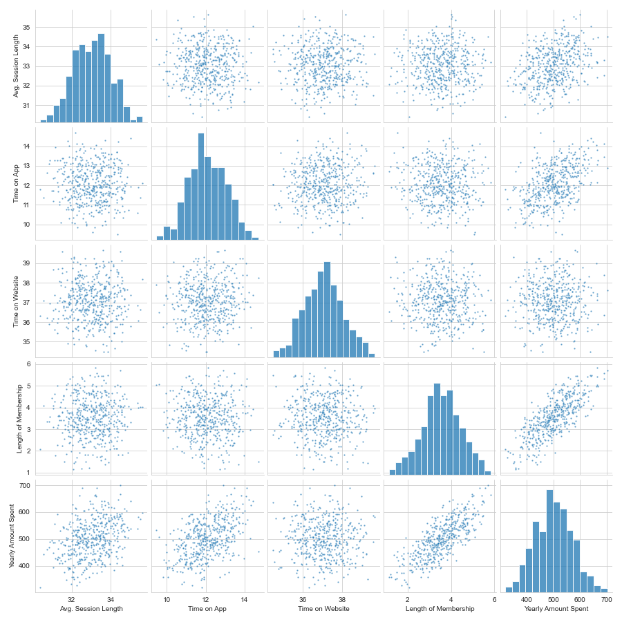  

- The correlations among numerical columns are shown below. The length of membership column has the highest value of correlation with the target column, yearly amount spent.  
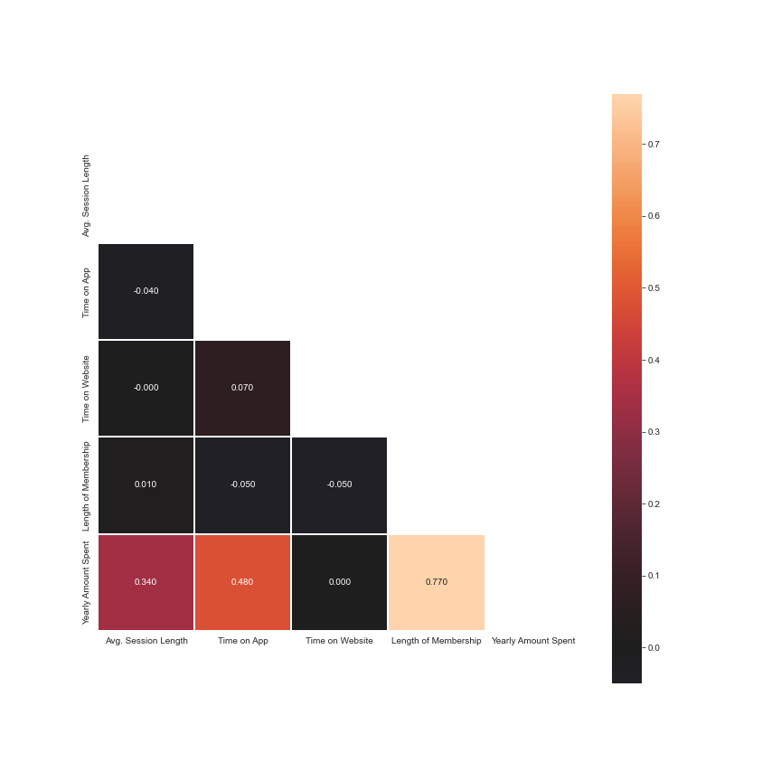  

- Below are the distribution of categorical column (email_service_provider column & state column).  
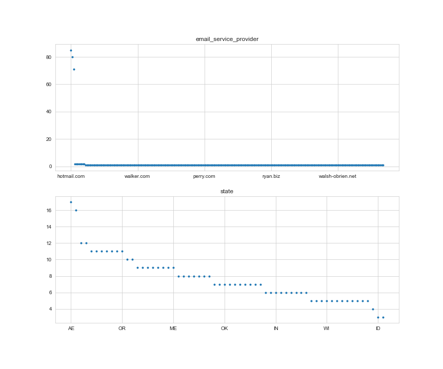  

- The distribution of state column which customers majority are coming from AE & AA states.  
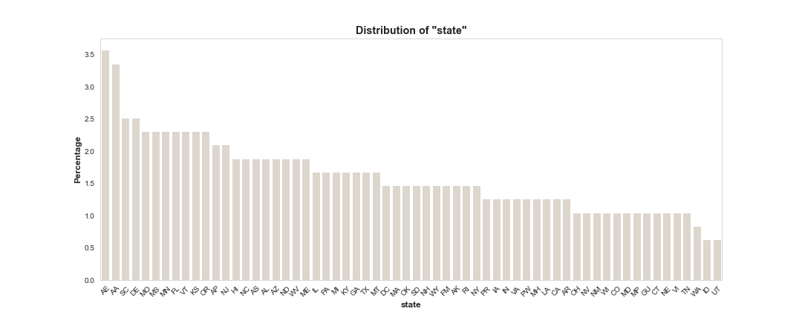  

- The distribution of state column vs yearly amount spent which total customers' spent majority are coming from AE & AA states.  
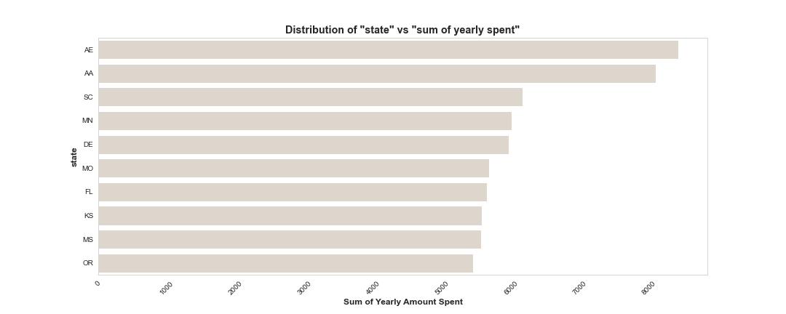  

- The distribution of email_service_provider column which majority are coming from hotmail, gmail, and yahoo.    
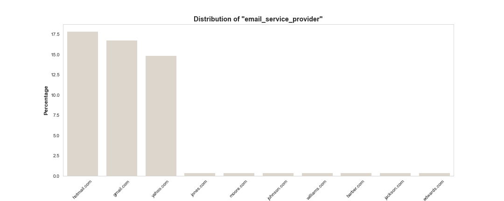  

- The distribution of email_service_provider column vs yearly amount spent which total customers' spent are also coming from customers using hotmail, gmail, and yahoo too.    
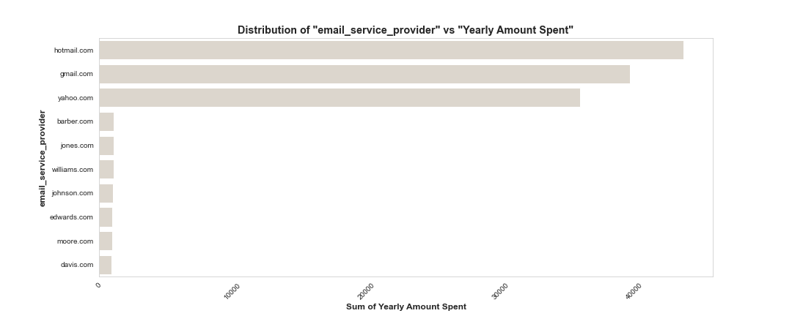  

- The distribution of domain column which majority are coming dot com.    
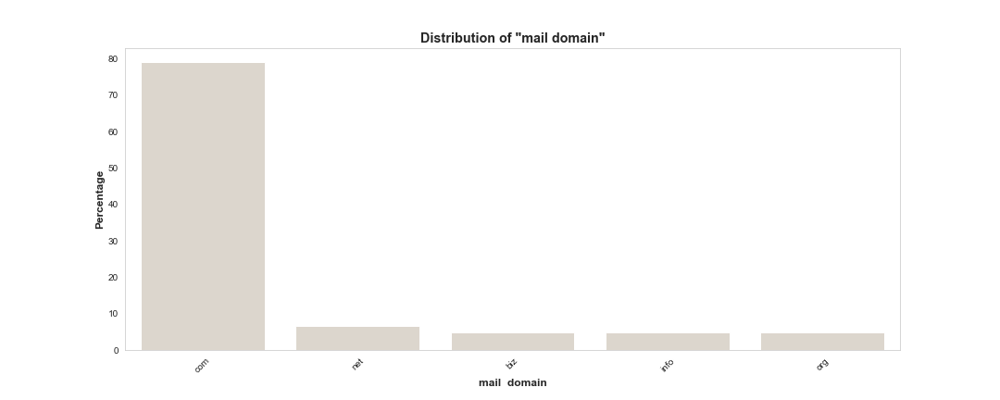  

- The distribution of domain column vs yearly amount spent which majority total customers' spent are coming also from customers using dot com domain.    
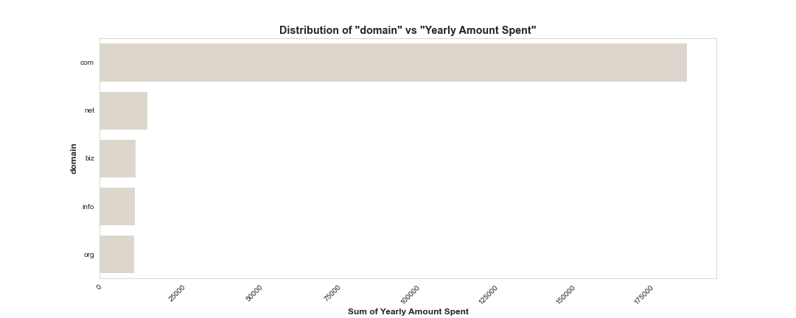  

---

## 
Regression Assumptions Check
  
To implement a regression method, below are assumptions that have been checked & met the assumptions:  
#### Linearity  
The predictors & target column seem to follow this assumption.  
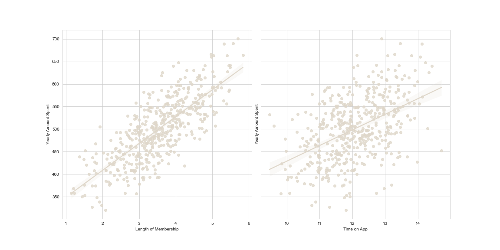  

#### Homoscedasticity  
Target column has equal variance, as the residuals are randomly scattered around the centerline of zero with no apparent pattern.  
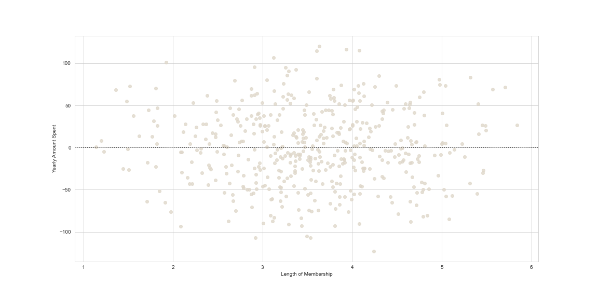  

#### Normal Distribution  
Yes the target column follow the normal distribution assumption.  
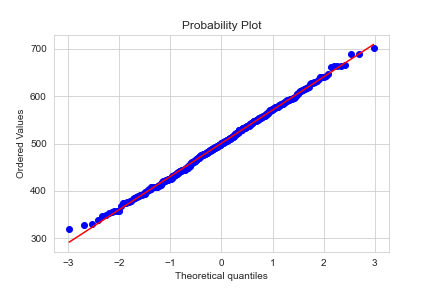  

#### No Multi-collinearity  
Just a little correlation among predictors.  
  

---

## 
Final Result
  
**1. Answering Stakeholders Questions**  
- *Which one should we focus on between market based on app or website?*  
Clearly market based on app which shown by the time on app column has a stronger correlation with target column, Yearly Amount Spent. However, further analysis should be done to analyze why the customer on average put higher time in the website instead. The follow-up questions are:
    - are the UI & UX or features of the mobile app better than the website, so the level of time spend in the mobile app is lower?
    - what are the reasons the users use the website higher than the mobile app?  
    
> To be clear, if the purpose is to increase the amount of yearly spent by users, the length of membership has the highest correlation with the target column. Therefore, measures taken to lengthen the membership time will be the main focus. Users analysis should be taken to analyze the behaviour of user purchase.  

**2. Modeling**  
The final model built is based on linear regression model (elasticnet) with:
- explained variance: **0.973**
- mean absolute error: **119.947**
- root mean squared error: **10.952** (mean of target column= 499.314)
- r2: **0.972**

**3. Univariate & Multivariate (EDA)**  
- Yearly amount of spent = 499.31 ± 79.314
- Length of memberhsip = 3.533 ± 0.999
- Time on App = 12.052 ± 0.994
- Time on Website = 37.060 ± 1.01
- Avg. Session Length = 33.053 ± 0.992  

- The columns which has most correlation with the target column (Yearly Amount Spent) is the Membership Length column, followup by Time on app and Avg. Session Length.  

- Relationship among variables:  
    - The "Membership Length" & "Yearly Amount Spent" have a strong linear relation
    - The "Time on App" & "Yearly Amount Spent" have a weaker linear relation
    - State AE & AA have the highest values of yearly spent
    - hotmail, gmail, and yahoo are the most frequently used mail by user (a login or a sign-up process to ease these mail user should be provided in the app or the website). The users from the mail services above are also most contributed to the yearly spent.  

**4. Follow-up Actions**  
- User analysis should be follow-up to learn the user purchasing behaviour & the keys driver to lengthen membership time.
- Further analysis to analyze why the user spend longer time in the website than in the app should be done.
- A model to predict yearly spent will be developed with REST API.
- A dashboard to visually describe operational will be developed.

---

